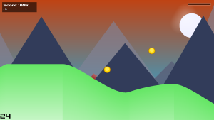
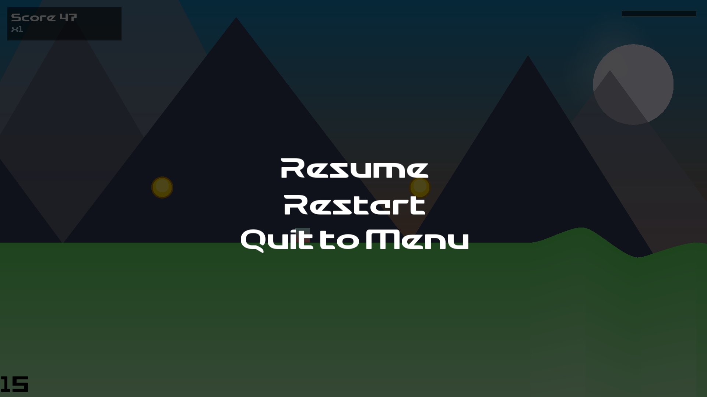
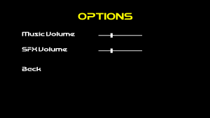
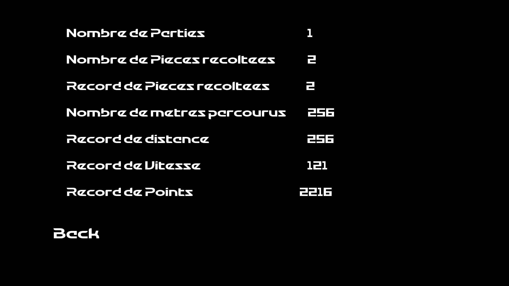

# 🏔️ Project Runner
   
## 📖 Présentation du jeu
**Project Runner** est un jeu de type *endless runner* développé en **C++ (norme C++20)** avec la bibliothèque **SFML 3.0.2**.
Le joueur incarne un personnage descendant une montagne infinie, en évitant les obstacles, ramassant des pièces et réalisant des figures pour accumuler des points.
## 🧩 Fonctionnalités principales
- 🏃 Système de vitesse progressive et boost temporaire
- 💰 Gestion du score et des pièces collectées
- 🎵 Paramètres audio (volume musique et effets)
- 🧊 Écrans multiples :
  - Menu principal
  - Jeu
  - Options
  - Statistiques
  - Pause
  - Game Over
## 🛠️ Technologies utilisées
- **Language** : C++20
- **Framework graphique** : SFML 3.0.2
- **IDE** : Visual Studio 2022
## 🎮 Commandes du jeu
| Action           | Touche |
|------------------|--------|
| Sauter           | Espace |
| Booster          | Espace |
| Tourner en l'air | Espace |
## 👤 Développeurs
- Toupetit2
- Kapt
  
  
